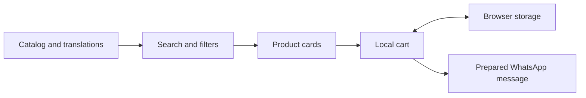

# Architecture and tradeoffs

Bernard is a static browser application. `index.html` supplies the page, `styles.css` supplies presentation, and `script.js` contains both catalog content and behavior.

## Data flow

The browser renders product cards from the `products` array. Search and category state determine which entries appear. Cart entries refer to product indices and normalized gram quantities, then persist under `bernard-order-cart` in local storage.

`setLanguage` re-renders interface text, products, and the cart. `calculateLinePrice` uses a per-kilogram calculation unless a product is marked `unit: "piece"`. `buildWhatsAppMessage` composes Hebrew order text; `openWhatsAppOrder` opens the configured WhatsApp link.

## Choices visible in the implementation

| Choice | Benefit | Cost or boundary |
| --- | --- | --- |
| Static hosting | Simple deployment and no application server | No authoritative inventory or order database |
| Inline translation dictionaries | Easy to inspect all four languages | Content updates require editing JavaScript |
| Local cart | Visitors can compose an order without an account | Browser-specific storage; no shared cart |
| Product indices as cart identifiers | Small amount of state | Reordering the catalog can change the meaning of a saved cart |
| WhatsApp handoff | Uses an existing communication channel | Message delivery and order acceptance happen outside this app |

## Boundaries

Displayed prices and client-side calculations are not authoritative financial records. This repository is a catalog/order-composition prototype, not an e-commerce backend. HTML escaping is present for interpolated content, but no independent security audit or comprehensive accessibility evaluation is claimed.
